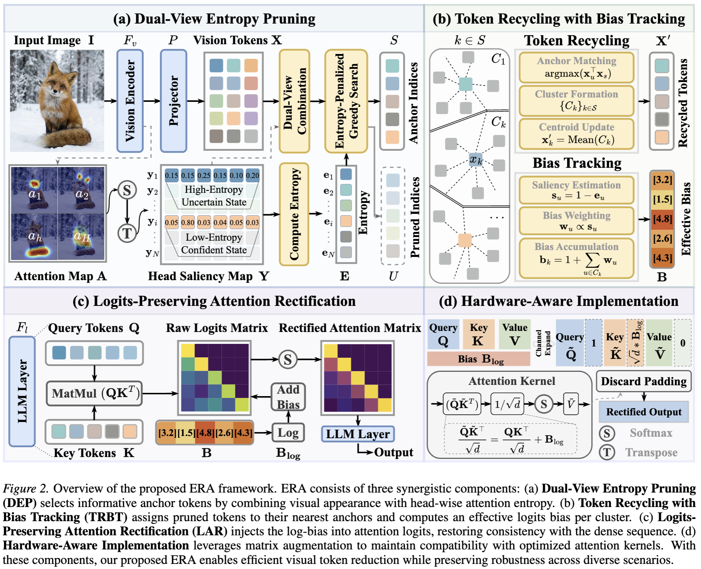
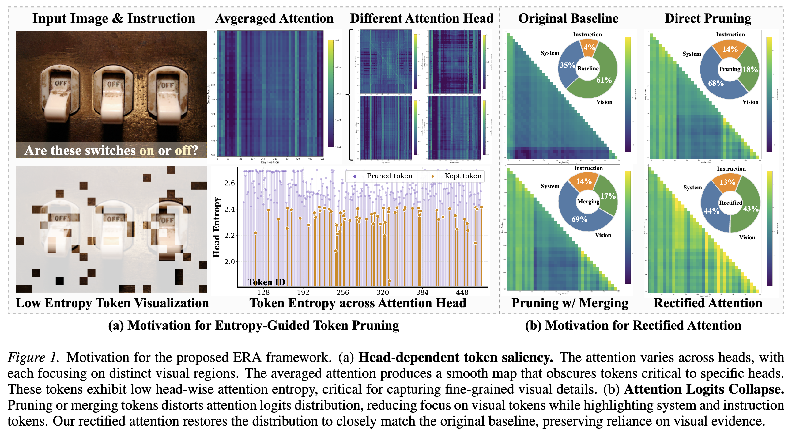
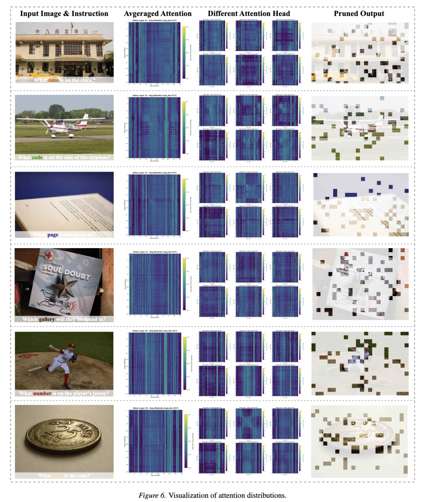
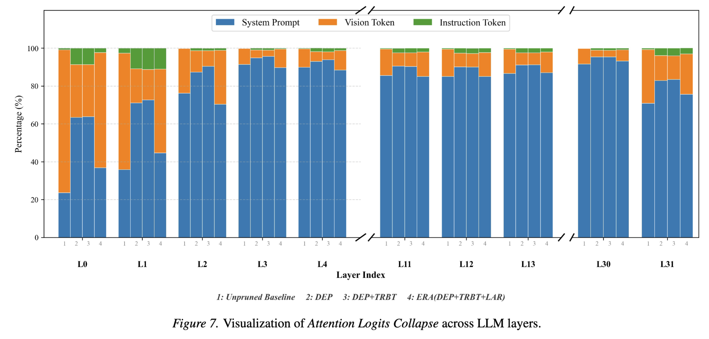
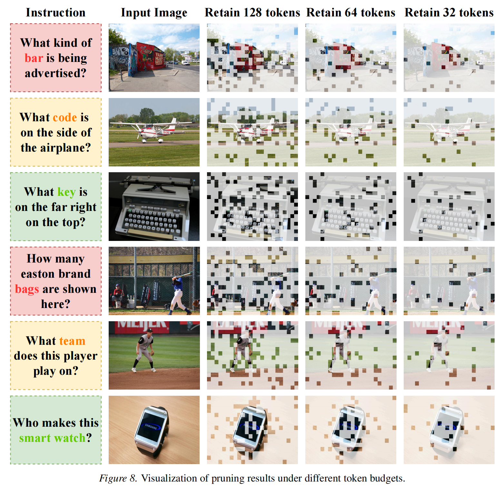
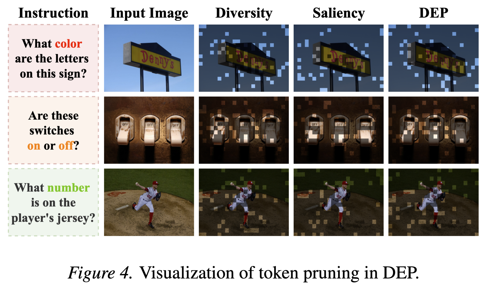
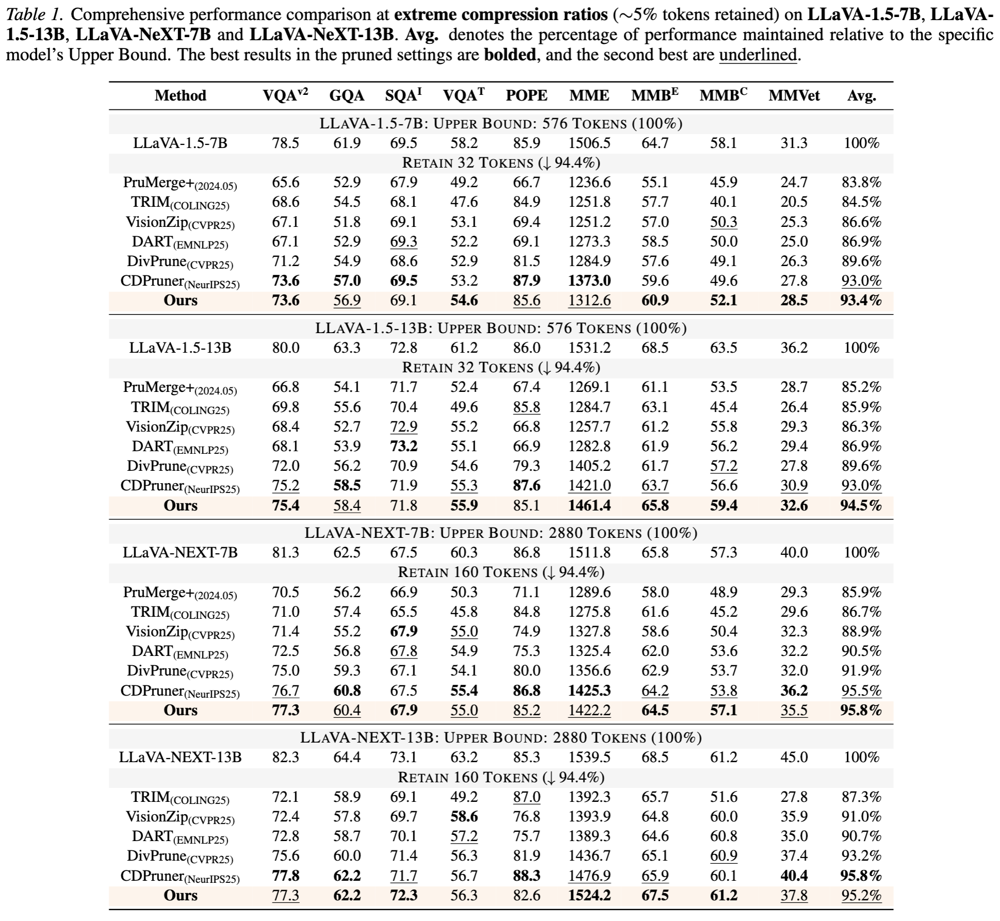
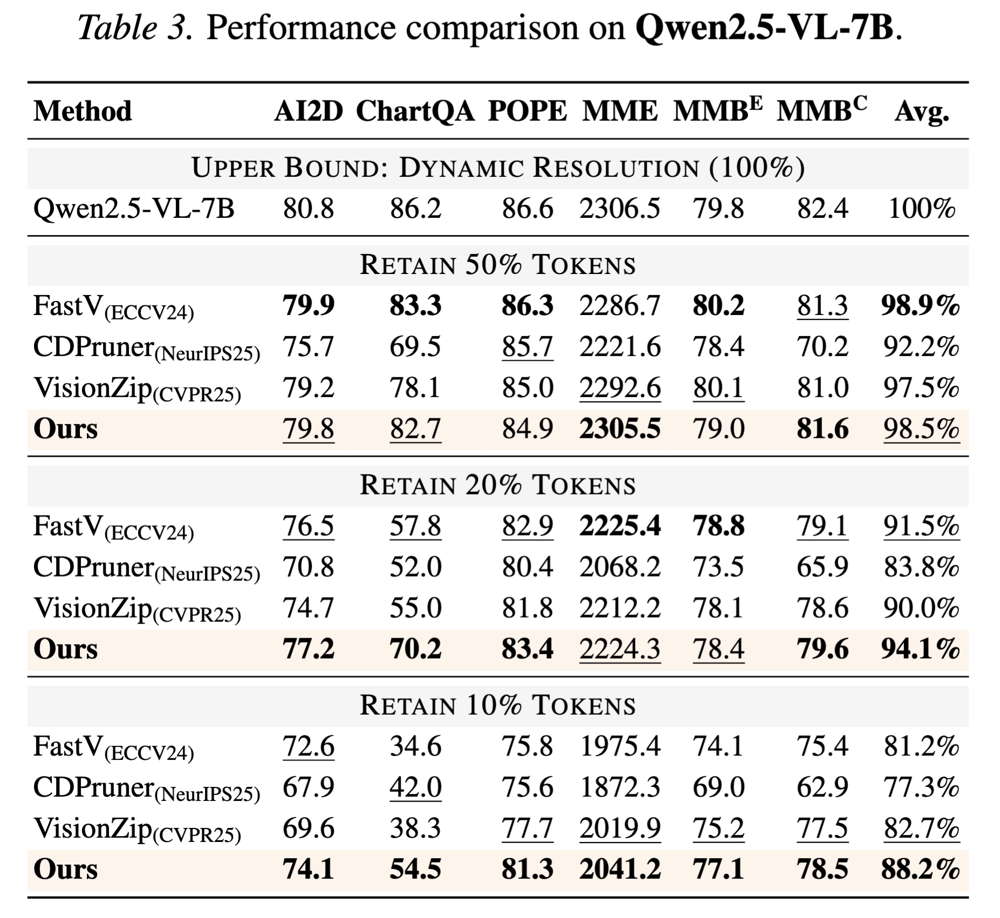
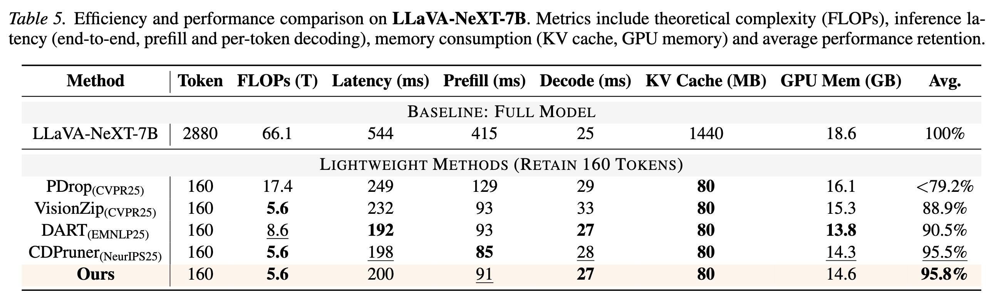

# ERA: Entropy-Guided Token Pruning with Rectified Attention

<p align="center">
	
</p>

**ERA** is a training-free, plug-and-play framework for accelerating inference in Multimodal Large Language Models (MLLMs). ERA identifies salient visual tokens via head-wise attention entropy and rectifies the *attention-logit collapse* phenomenon induced by token pruning, enabling **>10× visual token reduction** while maintaining strong performance across benchmarks.

---

## Contents

- [Key Features](#key-features)
- [Method Overview](#method-overview)
- [Visual Motivation](#visual-motivation)
- [Qualitative Pruning Results](#qualitative-pruning-results)
- [Performance](#performance)
- [Quick Start](#quick-start)
- [Citation](#citation)
- [License](#license)
- [Acknowledgements](#acknowledgements)

---

## Key Features

- **Training-free acceleration**: Improves inference efficiency without additional fine-tuning.
- **Logit rectification**: Mitigates attention-logit collapse so the pruned model better matches the baseline distribution.
- **Hardware-aware design**: Compatible with **FlashAttention-2** and optimized kernels (via matrix augmentation).
- **Dual-view selection**: Jointly models visual diversity and functional saliency (entropy) to retain fine-grained evidence.

---

## Method Overview

<p align="center">
	
</p>

ERA consists of three components:

1. **Dual-View Entropy Pruning (DEP)**: Selects anchor tokens by jointly modeling token diversity and head-wise attention entropy.
2. **Token Recycling with Bias Tracking (TRBT)**: Aggregates pruned tokens into anchors while tracking effective logit biases.
3. **Logits-Preserving Attention Rectification (LAR)**: Injects log-biases into attention logits to restore distribution consistency.

---

## Visual Motivation

<p align="center">
	
</p>

### Why Entropy?

<p align="center">
	
</p>

Head-averaged attention can obscure fine-grained visual evidence. **DEP** leverages head-wise entropy to identify “confident” tokens (low entropy) that are particularly important to specific heads.

### Why Rectification?

<p align="center">
	
</p>

Naïve pruning can distort attention-logit distributions and cause attention collapse. ERA rectifies logits to more closely match the baseline distribution.

---

## Qualitative Pruning Results

<p align="center">
	
</p>

<p align="center">
	
</p>

---

## Performance

### Results

<p align="center">
	
</p>

<p align="center">
	
</p>

<p align="center">
	
</p>

### Efficiency

<p align="center">
	
</p>

---

## Quick Start

**TO BE DONE.**

- Installation instructions and dependency list
- Example commands for inference and benchmarking
- Model integration guides (LLaVA / LLaVA-NeXT, Qwen, NEO, etc.)
- Reproducibility checklist (seeds, configs, evaluation protocol)

---

## Citation

If you find ERA useful in your research, please cite our paper:

```bibtex
TO BE DONE.
```

---

## License

This project is released under the [MIT License](LICENSE).

---

## Acknowledgements

Our implementation is built upon [LLaVA](https://github.com/haotian-liu/LLaVA) and [CDpruner](https://github.com/Theia-4869/CDPruner). We thank the authors for their open-source contributions.

---