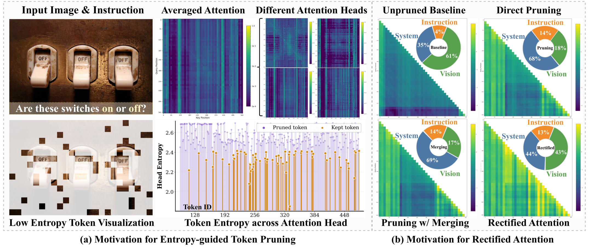
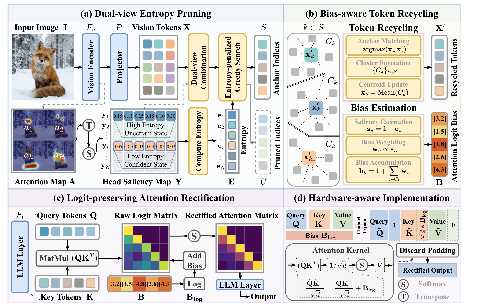

# ERA: Entropy-Guided Visual Token Pruning with Rectified Attention for Efficient MLLMs

*Training-free, plug-and-play visual token pruning with rectified attention for efficient MLLM inference.*

[💻 [Code](https://github.com/924973292/ERA)]

## 👁️ Overview

Multimodal Large Language Models (MLLMs) incur prohibitive inference costs due to long visual token sequences. Training-free visual token reduction is a practical solution, yet existing methods often distort attention distributions after compression. We identify this overlooked failure mode as **Attention Logit Collapse**: pruning or merging suppresses the accumulated attention logit assigned to visual tokens and shifts attention toward non-visual tokens, even when semantic content is partially preserved via token recycling.

Meanwhile, head-averaged attention can obscure tokens that are critical to specific heads. Head-wise entropy exposes low-entropy, head-specific responses concentrated on salient regions, providing an auxiliary criterion beyond diversity or sparsity alone.

**ERA** addresses both issues with entropy-guided pruning and logit-preserving attention rectification, enabling aggressive compression while preserving visual evidence across single-image, multi-image, and video settings.



## ⚙️ Method

ERA comprises three synergistic components:

1. **Dual-View Entropy Pruning (DEP)** selects anchor tokens in a unified space that jointly models visual diversity and head-wise saliency derived from attention entropy.
2. **Bias-aware Token Recycling (BTR)** recycles pruned tokens into their nearest anchors and estimates a cluster-level logit bias that records the accumulated contribution of discarded visual evidence.
3. **Logit-preserving Attention Rectification (LAR)** injects the estimated bias into attention logits to rectify Attention Logit Collapse and keep the compressed attention distribution consistent with the full-sequence baseline. LAR admits a kernel-friendly realization via matrix augmentation and remains compatible with optimized attention implementations such as FlashAttention-2.



## ✨ Highlights

1. **>10× visual token reduction** under aggressive compression while maintaining strong benchmark performance.
2. **93.4%** average performance retention on LLaVA-1.5-7B with only **~5%** visual tokens retained (32 / 576 tokens).
3. Robust across **LLaVA-1.5**, **LLaVA-NeXT**, **Qwen2.5-VL**, **InternVL3**, and **NEO**, covering static projection, high-resolution, dynamic-resolution, and encoder-free MLLM paradigms.
4. **FlashAttention-2** compatible via matrix augmentation — no modification to the attention kernel is required.
5. Delivers practical inference gains, including up to **11.8×** FLOPs reduction, **4.6×** prefill speedup, and **>5×** KV-cache reduction on LLaVA-NeXT-7B under extreme compression.

## 🛠️ Setup

**TO BE DONE.**

### Environment

- Installation instructions and dependency list

### Supported Models

- LLaVA-1.5 / LLaVA-NeXT
- Qwen2.5-VL
- InternVL3
- NEO

### Evaluation

- Example commands for inference and benchmarking
- Reproducibility checklist (seeds, configs, evaluation protocol)

## 🔖 Citation

If you find ERA useful for your research and applications, please cite using this BibTeX:

```bibtex
@article{wang2026era,
  title={ERA: Entropy-Guided Visual Token Pruning with Rectified Attention for Efficient MLLMs},
  author={Wang, Yuhao and Qiao, Mu and Diao, Haiwen and Zhuge, Yunzhi and Zhang, Pingping and Zhang, Xindong and Zhang, Lei and Lu, Huchuan},
  journal={IEEE Transactions on Pattern Analysis and Machine Intelligence},
  year={2026},
  note={Code available at \url{https://github.com/924973292/ERA}}
}
```

## 🎟️ License

This project is released under the [MIT License](LICENSE).

## 🏅 Acknowledgement

Our implementation is built upon [LLaVA](https://github.com/haotian-liu/LLaVA) and [CDPruner](https://github.com/Theia-4869/CDPruner). We thank the authors for their open-source contributions.
