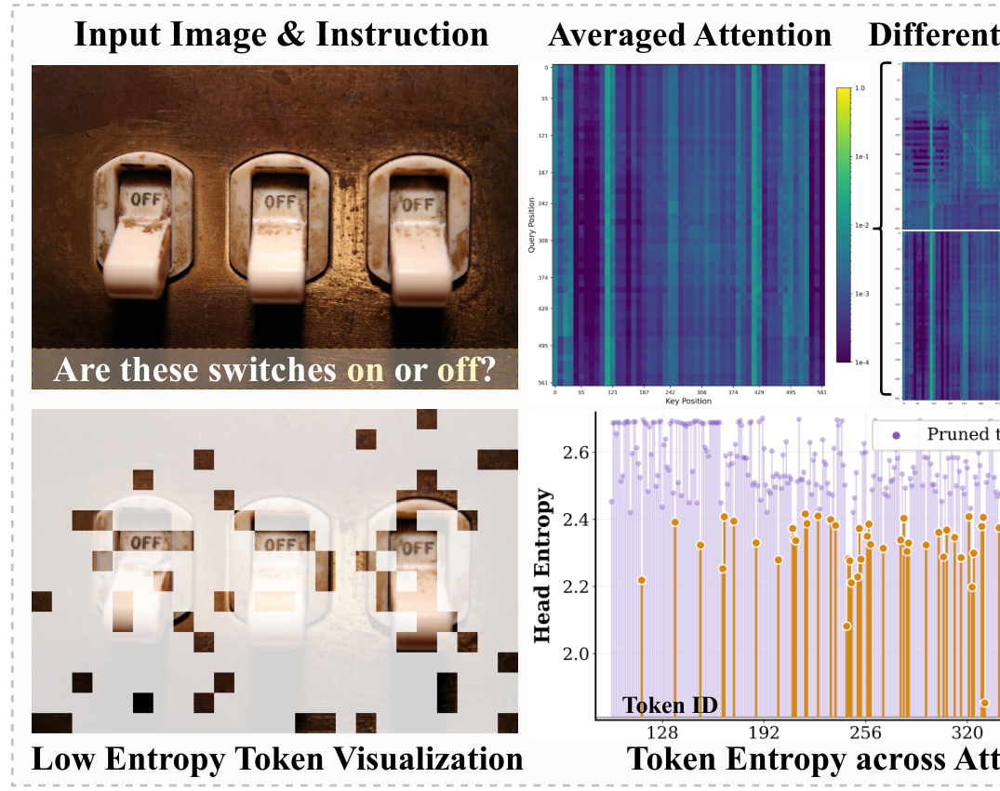
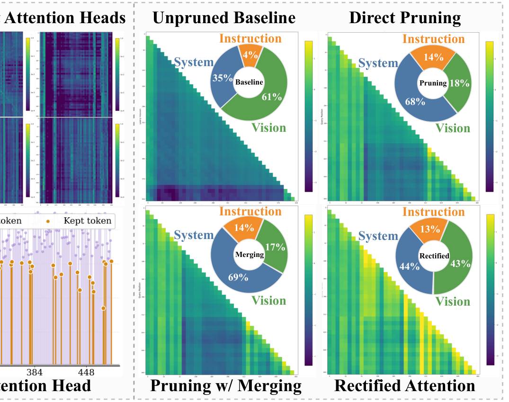
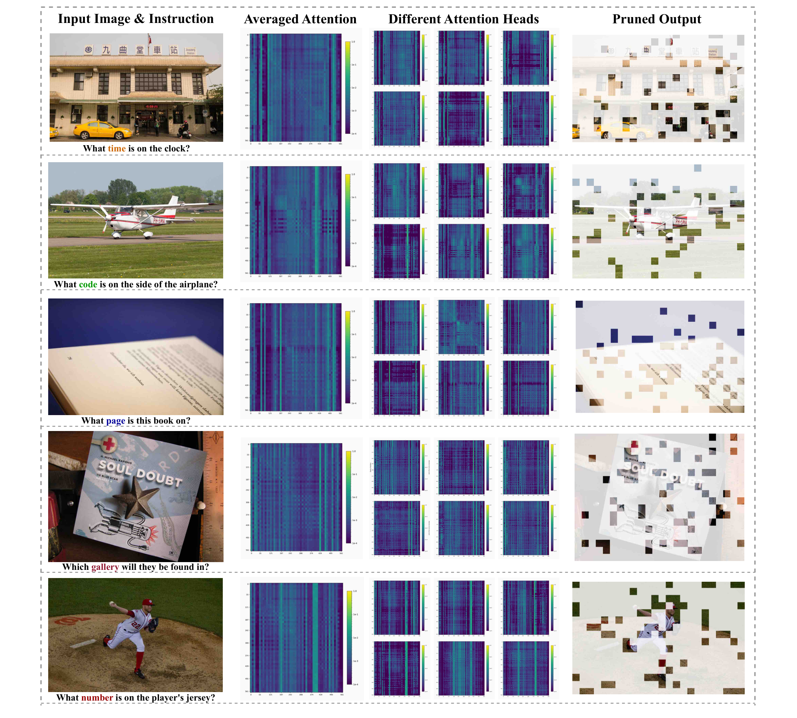
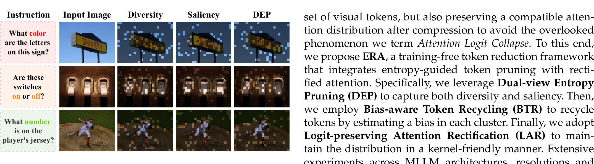
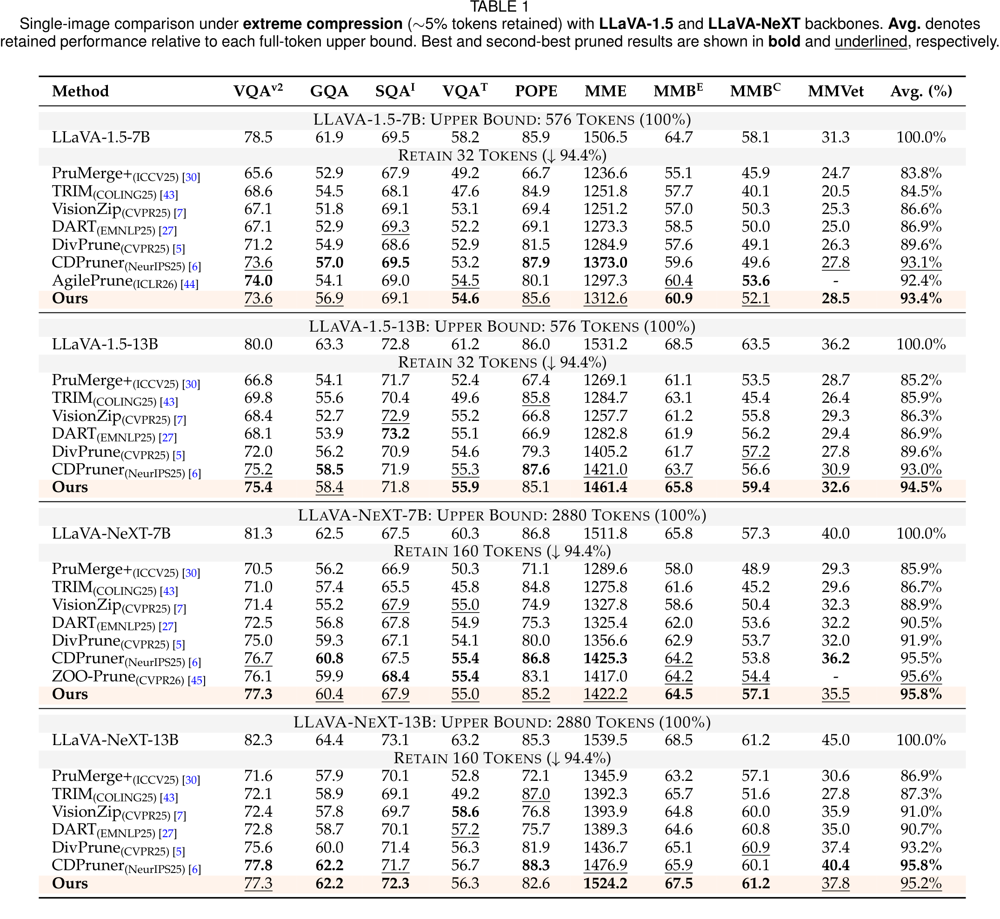
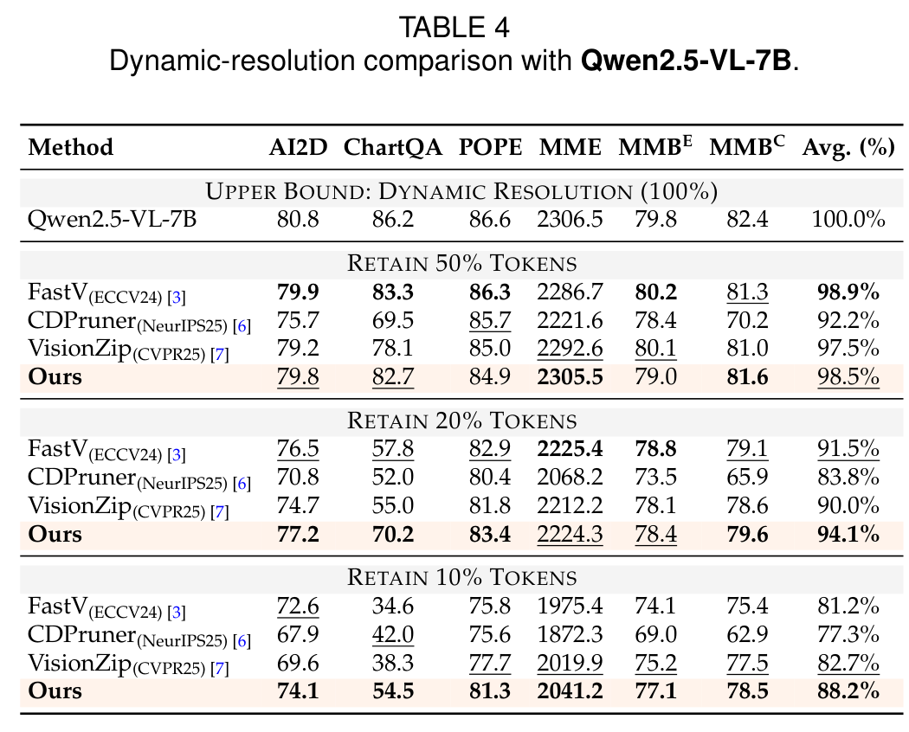
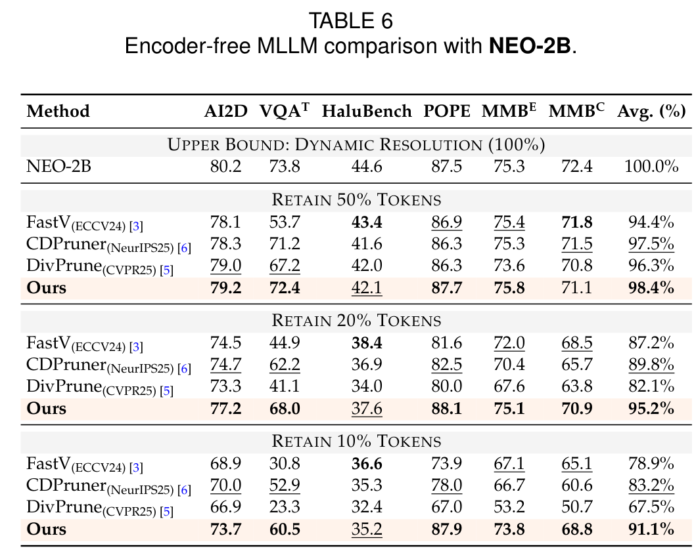
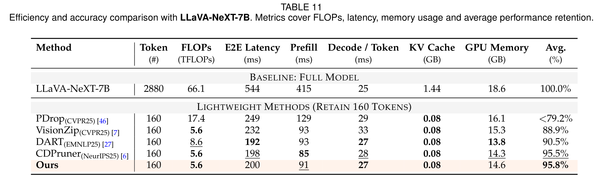

# ERA: Entropy-Guided Visual Token Pruning with Rectified Attention for Efficient MLLMs

<p align="center">
	
</p>

**ERA** is a training-free, plug-and-play framework for accelerating inference in Multimodal Large Language Models (MLLMs). ERA identifies salient visual tokens via head-wise attention entropy and rectifies *Attention Logit Collapse* induced by token pruning, enabling **>10× visual token reduction** while maintaining strong performance across single-image, multi-image, and video settings. Beyond practical acceleration, ERA establishes logit-preserving visual token pruning as a principled framework for efficient MLLMs.

---

## Contents

- [Key Features](#key-features)
- [Method Overview](#method-overview)
- [Visual Motivation](#visual-motivation)
- [Qualitative Pruning Results](#qualitative-pruning-results)
- [Performance](#performance)
- [Quick Start](#quick-start)
- [Citation](#citation)
- [License](#license)
- [Acknowledgements](#acknowledgements)

---

## Key Features

- **Training-free acceleration**: Improves inference efficiency without additional fine-tuning.
- **Logit rectification**: Mitigates Attention Logit Collapse so the pruned model better matches the baseline distribution.
- **Hardware-aware design**: Compatible with **FlashAttention-2** and optimized attention kernels via matrix augmentation (Fig. 2d).
- **Dual-view selection**: Jointly models visual diversity and head-wise saliency (entropy) to retain fine-grained evidence.

---

## Method Overview

<p align="center">
	
</p>

ERA consists of three components:

1. **Dual-View Entropy Pruning (DEP)**: Selects anchor tokens by jointly modeling visual diversity and head-wise attention entropy.
2. **Bias-aware Token Recycling (BTR)**: Recycles pruned tokens into anchors while estimating cluster-level logit bias.
3. **Logits-Preserving Attention Rectification (LAR)**: Injects log-biases into attention logits to restore distribution consistency.

---

## Visual Motivation

<p align="center">
	
</p>

### Why Entropy?

<p align="center">
	
</p>

Head-averaged attention can obscure fine-grained visual evidence. **DEP** leverages head-wise entropy to identify “confident” tokens (low entropy) that are particularly important to specific heads.

### Why Rectification?

<p align="center">
	
</p>

Naïve pruning can distort attention-logit distributions and cause Attention Logit Collapse. ERA rectifies logits to more closely match the baseline distribution.

---

## Qualitative Pruning Results

<p align="center">
	
</p>

<p align="center">
	
</p>

---

## Performance

### Results

<p align="center">
	
</p>

<p align="center">
	
</p>

<p align="center">
	
</p>

### Efficiency

<p align="center">
	
</p>

---

## Quick Start

**TO BE DONE.**

- Installation instructions and dependency list
- Example commands for inference and benchmarking
- Model integration guides (LLaVA / LLaVA-NeXT, Qwen, NEO, etc.)
- Reproducibility checklist (seeds, configs, evaluation protocol)

---

## Citation

If you find ERA useful in your research, please cite our paper:

```bibtex
@article{wang2026era,
  title={ERA: Entropy-Guided Visual Token Pruning with Rectified Attention for Efficient MLLMs},
  author={Wang, Yuhao and Qiao, Mu and Diao, Haiwen and Zhuge, Yunzhi and Zhang, Pingping and Zhang, Xindong and Zhang, Lei and Lu, Huchuan},
  journal={IEEE Transactions on Pattern Analysis and Machine Intelligence},
  year={2026},
  note={Code available at \url{https://github.com/924973292/ERA}}
}
```

---

## License

This project is released under the [MIT License](LICENSE).

---

## Acknowledgements

Our implementation is built upon [LLaVA](https://github.com/haotian-liu/LLaVA) and [CDPruner](https://github.com/Theia-4869/CDPruner). We thank the authors for their open-source contributions.

---
